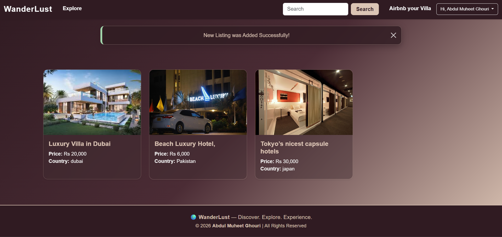

# Wanderlust – Full Stack Web Application

Wanderlust is a full-stack web application designed to allow users to explore, create, and manage travel listings. The platform enables users to share destinations, upload images, and interact through reviews.

## Features
- User authentication
- CRUD operations for listings
- Reviews system
- Image uploads (Cloudinary)

## Tech Stack
- Node.js, Express
- MongoDB (Mongoose)
- EJS, Bootstrap

## Deployment
Configured for Render + MongoDB Atlas.

## Author
Abdul Muheet Ghouri
